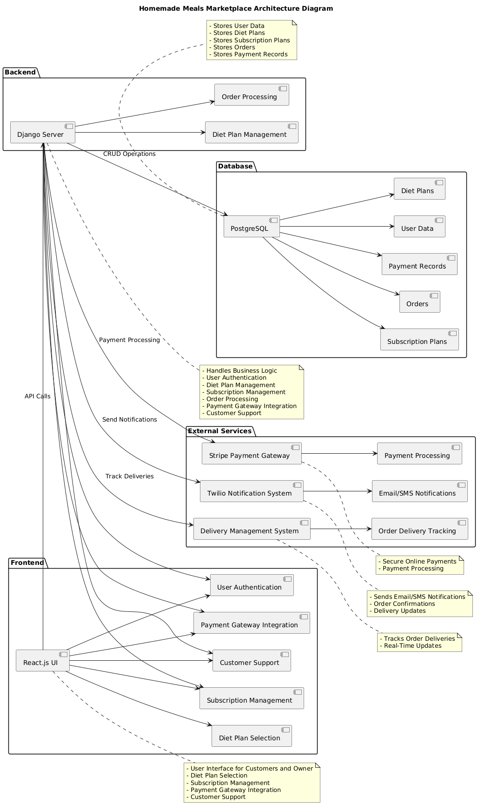

# Homemade Meals Marketplace App
**Team 8** | BTP405 Winter 2025 | [GitHub Repo](https://github.com/Gssodhi/btp405-mealmarket)  

  
*Architecture Diagram (Sprint 1)*  

## 📌 Project Overview
An online marketplace connecting home chefs with customers for healthy meal subscriptions (weekly/monthly/yearly plans).  
**Key Features**:  
- Dietary-specific plans (Veg/Non-Veg/Vegan)  
- Flexible meal delivery options (1-2 meals/day)  
- Secure online payments  

---

## 🛠️ Sprint 1 Deliverables
### Backend (Django)
- ✅ DietPlan model with meal types and pricing  
- ✅ Admin panel for managing meal plans  
- ```bash
  cd backend
  python manage.py runserver
  ```

### Frontend (React)
- ✅ Basic meal plan browser (hardcoded data)  
- ```bash
  cd frontend
  npm install
  npm start
  ```

---

## 📂 Project Structure
```
btp405-mealmarket/
├── backend/               # Django project
│   ├── manage.py
│   └── backend/          # Settings and URLs
├── frontend/             # React app
│   ├── src/              # Main React components
│   └── package.json
└── docs/                 # Documentation
    ├── architecture.png  # System diagram
    └── personas_user_stories.md
    
```

---

## 🚀 Setup Guide
1. **Clone the repo**:
   ```bash
   git clone https://github.com/Gssodhi/btp405-mealmarket.git
   cd btp405-mealmarket
   ```

2. **Backend Setup**:
   ```bash
   python -m venv venv
   source venv/bin/activate       # Linux/Mac
   venv\Scripts\activate         # Windows
   pip install -r backend/requirements.txt
   cd backend
   python manage.py migrate
   ```

3. **Frontend Setup**:
   ```bash
   cd frontend
   npm install
   npm start
   ```

---

## 📜 Documentation
- [Product Vision](docs/vision_scope.md)  
- [User Personas & Stories](docs/personas_user_stories.md)  
- [System Architecture](docs/architecture.png)  

---

## 👥 Team Members
- [Gurjeet] (Project Manager)  
- [amusoni] (Backend Developer)  
- [Navish] (Frontend Developer)  
- [Nidhi] (Researcher)  
